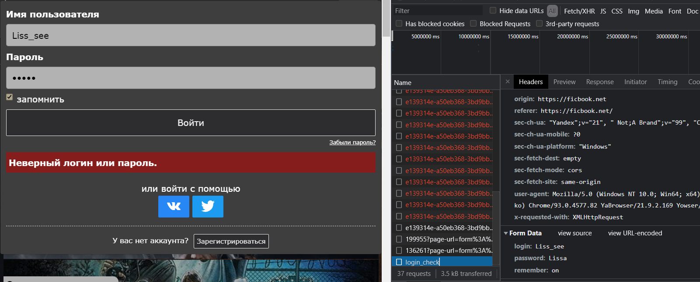
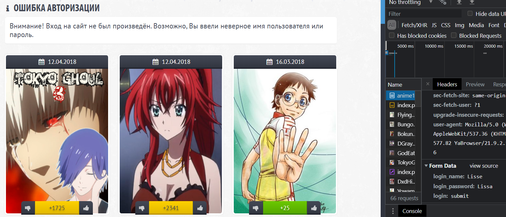

# 2-Socials-Authentication
# __Эссе №2__
___
## __Задача__
>_написать эссе, в котором нужно проанализировать процесс аутентификации пользователей в двух произвольных web-ресурсах._
---

## __Основная часть__
Первое испытание я решила провести на сайте __ficbook__[^1]

Главная страница
  При переходе на страницу авторизации у нас появляется раздел _loging_check_. 
  Затем, при попытке неверной авторизации, при условии, что у пользователя стоит двухфакторная аутентификация, у нас выполнятся запрос _getrsakey/_ и _dologin/_, а в __From Data__ отображаются введенные данные в разделах _login_ и _password_, а так же отображается пометка _remember: on_, если мы нажали кнопку _"запомнить"_. При этом, даже, при неудачной авторизации будут выполнены запросы, в ответ на которые сервер вернёт _Status Code: 200_, что говорит нам об успешности запроса.

 Пример неудачной авторизации
Если мы введем правильные данные для входа, то нас так же как и в случае провала перебросит на главную страницу сайта, только теперь как авторизированного пользователя, для которого появляются немколько дополнительных возможностей, в этом случае сервер также вернёт _Status Code: 200_.
 Однако, пока мы не авторизируемся как пользователь у нас не будет доступа к страницам для написания и редактирования собственных и чужих фанфиков, а так же не будет возможности сохранять себе понравившиеся работы авторов.

---
Для второго испытания я выбрала сайт __anime100500__[^2]

Главная страница
  При попытке авторизации (так же как и в первом испытании) мы остаемся на главной странице, однако дополнительного раздела ( _loging_check_) у нас не появляется.
При попытке неверного ввода данных нас снова перебрасывает на главную страницу, где мы можем увидеть сообщение об ошибке авторизации. Также будут выполнены некоторые запросы, в ответ на которые сервер вернёт _Status Code: 200_, а в __From Data__ будут переданы введенные данные в разделах _login_ и _password_

 Пример неудачной авторизации

---
##Вывод:
Таким образом, мы можем увидеть, что атентификация на двух разных сайтах может быть похожей, но отличаться в некоторых деталях. В основе работы аутентификации пользователей лежит поиск в базе данных записи с логином и паролем. Если же запись не будет найдена, на странице будет выведено сообщение об ошибке авторизации или просто вернет нас на главную страницу сайта, а также вернётся код с ошибкой авторизации.

---
[^1]: [ficbook](https://ficbook.net/)
[^2]: [anime100500](https://anime100500.ru/)
